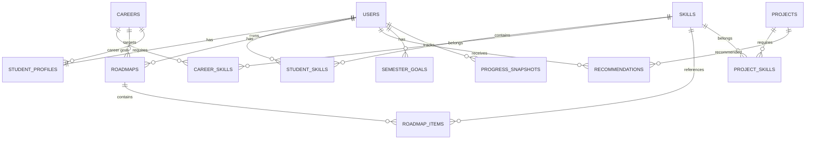

# PATHFORGE AI — Database Documentation

## Overview

PATHFORGE AI uses **PostgreSQL** with **Prisma ORM** for type-safe database access. The database contains 13 tables with proper relationships, constraints, and indexes.

---

## Entity Relationship Diagram

---

## Tables

### 1. users

Stores all user accounts (students and admins).

| Column | Type | Constraints | Description |
|---|---|---|---|
| id | UUID | PRIMARY KEY | Unique identifier |
| name | VARCHAR(100) | NOT NULL | User's full name |
| email | VARCHAR(255) | UNIQUE, NOT NULL | Login email |
| password_hash | VARCHAR(255) | NOT NULL | Bcrypt hashed password |
| role | VARCHAR(20) | DEFAULT 'student' | User role (student/admin) |
| created_at | TIMESTAMP | DEFAULT NOW() | Account creation time |
| updated_at | TIMESTAMP | AUTO UPDATE | Last update time |

**Indexes:** `email` (unique)

---

### 2. student_profiles

Extended profile information for students.

| Column | Type | Constraints | Description |
|---|---|---|---|
| id | UUID | PRIMARY KEY | Unique identifier |
| user_id | UUID | UNIQUE, FK → users.id | Associated user |
| branch | VARCHAR(100) | NOT NULL | Engineering branch |
| semester | INTEGER | NOT NULL | Current semester (1-8) |
| college | VARCHAR(200) | NOT NULL | College name |
| career_goal_id | UUID | FK → careers.id, NULLABLE | Target career |
| study_hours_per_week | INTEGER | NULLABLE | Weekly study hours |
| bio | TEXT | NULLABLE | Student biography |
| created_at | TIMESTAMP | DEFAULT NOW() | Creation time |
| updated_at | TIMESTAMP | AUTO UPDATE | Last update time |

**Indexes:** `user_id` (unique), `career_goal_id`

---

### 3. skills

Catalog of all skills in the system.

| Column | Type | Constraints | Description |
|---|---|---|---|
| id | UUID | PRIMARY KEY | Unique identifier |
| name | VARCHAR(100) | UNIQUE, NOT NULL | Skill name |
| category | VARCHAR(50) | NOT NULL | Skill category |
| description | TEXT | NULLABLE | Skill description |
| difficulty | VARCHAR(20) | NOT NULL | Beginner/Intermediate/Advanced |
| is_active | BOOLEAN | DEFAULT TRUE | Whether skill is active |
| created_at | TIMESTAMP | DEFAULT NOW() | Creation time |
| updated_at | TIMESTAMP | AUTO UPDATE | Last update time |

**Indexes:** `name` (unique)

---

### 4. careers

Career paths available in the system.

| Column | Type | Constraints | Description |
|---|---|---|---|
| id | UUID | PRIMARY KEY | Unique identifier |
| title | VARCHAR(100) | UNIQUE, NOT NULL | Career title |
| description | TEXT | NULLABLE | Career description |
| category | VARCHAR(50) | NOT NULL | Career category |
| difficulty | VARCHAR(20) | NOT NULL | Difficulty level |
| average_learning_hours | INTEGER | NOT NULL | Estimated hours to learn |
| required_education | VARCHAR(200) | NOT NULL | Required education level |
| is_active | BOOLEAN | DEFAULT TRUE | Whether career is active |
| created_at | TIMESTAMP | DEFAULT NOW() | Creation time |
| updated_at | TIMESTAMP | AUTO UPDATE | Last update time |

**Indexes:** `title` (unique)

---

### 5. career_skills

Junction table linking careers to their required skills.

| Column | Type | Constraints | Description |
|---|---|---|---|
| id | UUID | PRIMARY KEY | Unique identifier |
| career_id | UUID | FK → careers.id | Associated career |
| skill_id | UUID | FK → skills.id | Associated skill |
| weight | DECIMAL(3,2) | NOT NULL | Importance weight (0.0-1.0) |
| required_level | INTEGER | NOT NULL | Required skill level (1-5) |
| importance | VARCHAR(10) | NOT NULL | HIGH/MEDIUM/LOW |
| created_at | TIMESTAMP | DEFAULT NOW() | Creation time |

**Constraints:** UNIQUE(career_id, skill_id)
**Indexes:** `career_id`, `skill_id`

---

### 6. student_skills

Junction table tracking student skill levels.

| Column | Type | Constraints | Description |
|---|---|---|---|
| id | UUID | PRIMARY KEY | Unique identifier |
| student_id | UUID | FK → users.id | Associated student |
| skill_id | UUID | FK → skills.id | Associated skill |
| level | INTEGER | NOT NULL | Skill level (1-5) |
| created_at | TIMESTAMP | DEFAULT NOW() | Creation time |

**Constraints:** UNIQUE(student_id, skill_id)
**Indexes:** `student_id`, `skill_id`

**Level Scale:**
- 1 = Beginner
- 2 = Basic
- 3 = Intermediate
- 4 = Advanced
- 5 = Expert

---

### 7. roadmaps

Learning roadmaps generated for students.

| Column | Type | Constraints | Description |
|---|---|---|---|
| id | UUID | PRIMARY KEY | Unique identifier |
| student_id | UUID | FK → users.id | Associated student |
| career_id | UUID | FK → careers.id | Target career |
| title | VARCHAR(200) | NOT NULL | Roadmap title |
| description | TEXT | NULLABLE | Roadmap description |
| readiness_at_creation | DECIMAL(5,2) | NULLABLE | Readiness % at creation |
| estimated_total_hours | INTEGER | NULLABLE | Total estimated hours |
| status | VARCHAR(20) | DEFAULT 'not_started' | not_started/in_progress/completed |
| created_at | TIMESTAMP | DEFAULT NOW() | Creation time |
| updated_at | TIMESTAMP | AUTO UPDATE | Last update time |

**Indexes:** `student_id`, `career_id`

---

### 8. roadmap_items

Individual steps within a roadmap.

| Column | Type | Constraints | Description |
|---|---|---|---|
| id | UUID | PRIMARY KEY | Unique identifier |
| roadmap_id | UUID | FK → roadmaps.id | Parent roadmap |
| skill_id | UUID | FK → skills.id, NULLABLE | Associated skill |
| title | VARCHAR(200) | NOT NULL | Item title |
| description | TEXT | NULLABLE | Item description |
| step_order | INTEGER | NOT NULL | Order in roadmap |
| estimated_hours | INTEGER | NOT NULL | Estimated hours |
| difficulty | VARCHAR(20) | NOT NULL | Difficulty level |
| resources | JSONB | NULLABLE | Learning resources array |
| status | VARCHAR(20) | DEFAULT 'not_started' | Item status |
| progress_percentage | INTEGER | DEFAULT 0 | Progress (0-100) |
| completed_at | TIMESTAMP | NULLABLE | Completion time |
| created_at | TIMESTAMP | DEFAULT NOW() | Creation time |
| updated_at | TIMESTAMP | AUTO UPDATE | Last update time |

**Indexes:** `roadmap_id`, `skill_id`

---

### 9. projects

Project ideas for students to build.

| Column | Type | Constraints | Description |
|---|---|---|---|
| id | UUID | PRIMARY KEY | Unique identifier |
| title | VARCHAR(200) | NOT NULL | Project title |
| description | TEXT | NULLABLE | Project description |
| difficulty | VARCHAR(20) | NOT NULL | Difficulty level |
| estimated_hours | INTEGER | NOT NULL | Estimated hours |
| technologies | TEXT[] | NOT NULL | Required technologies |
| features | TEXT[] | NOT NULL | Key features |
| branch_compatibility | TEXT[] | NOT NULL | Compatible branches |
| github_template_url | VARCHAR(500) | NULLABLE | Template repo URL |
| created_at | TIMESTAMP | DEFAULT NOW() | Creation time |
| updated_at | TIMESTAMP | AUTO UPDATE | Last update time |

---

### 10. project_skills

Junction table linking projects to required skills.

| Column | Type | Constraints | Description |
|---|---|---|---|
| id | UUID | PRIMARY KEY | Unique identifier |
| project_id | UUID | FK → projects.id | Associated project |
| skill_id | UUID | FK → skills.id | Associated skill |

**Constraints:** UNIQUE(project_id, skill_id)
**Indexes:** `project_id`, `skill_id`

---

### 11. recommendations

Project recommendations for students.

| Column | Type | Constraints | Description |
|---|---|---|---|
| id | UUID | PRIMARY KEY | Unique identifier |
| student_id | UUID | FK → users.id | Associated student |
| project_id | UUID | FK → projects.id | Recommended project |
| reason | TEXT | NOT NULL | Recommendation reason |
| matched_skills | TEXT[] | NOT NULL | Skills that matched |
| match_percentage | DECIMAL(5,2) | NOT NULL | Match percentage |
| priority | VARCHAR(10) | NOT NULL | high/medium/low |
| created_at | TIMESTAMP | DEFAULT NOW() | Creation time |

**Indexes:** `student_id`, `project_id`

---

### 12. semester_goals

Student goals for each semester.

| Column | Type | Constraints | Description |
|---|---|---|---|
| id | UUID | PRIMARY KEY | Unique identifier |
| student_id | UUID | FK → users.id | Associated student |
| title | VARCHAR(200) | NOT NULL | Goal title |
| description | TEXT | NULLABLE | Goal description |
| semester | INTEGER | NOT NULL | Target semester (1-8) |
| target_date | DATE | NOT NULL | Target completion date |
| progress_percentage | INTEGER | DEFAULT 0 | Progress (0-100) |
| status | VARCHAR(20) | DEFAULT 'not_started' | Goal status |
| created_at | TIMESTAMP | DEFAULT NOW() | Creation time |
| updated_at | TIMESTAMP | AUTO UPDATE | Last update time |

**Indexes:** `student_id`

---

### 13. progress_snapshots

Daily/weekly progress tracking snapshots.

| Column | Type | Constraints | Description |
|---|---|---|---|
| id | UUID | PRIMARY KEY | Unique identifier |
| student_id | UUID | FK → users.id | Associated student |
| date | DATE | NOT NULL | Snapshot date |
| study_hours | DECIMAL(5,2) | NOT NULL | Hours studied |
| completed_roadmap_items | INTEGER | NOT NULL | Items completed |
| completed_projects | INTEGER | NOT NULL | Projects completed |
| readiness_percentage | DECIMAL(5,2) | NOT NULL | Overall readiness % |
| skills_improved | TEXT[] | NOT NULL | Skills improved |
| created_at | TIMESTAMP | DEFAULT NOW() | Creation time |

**Indexes:** `student_id`, `date`

---

## Relationships Summary

| Parent | Child | Relationship | On Delete |
|---|---|---|---|
| users | student_profiles | 1:1 | CASCADE |
| users | student_skills | 1:N | CASCADE |
| skills | student_skills | 1:N | CASCADE |
| careers | career_skills | 1:N | CASCADE |
| skills | career_skills | 1:N | CASCADE |
| users | roadmaps | 1:N | CASCADE |
| careers | roadmaps | 1:N | CASCADE |
| roadmaps | roadmap_items | 1:N | CASCADE |
| skills | roadmap_items | 1:N | SET NULL |
| projects | project_skills | 1:N | CASCADE |
| skills | project_skills | 1:N | CASCADE |
| users | recommendations | 1:N | CASCADE |
| projects | recommendations | 1:N | CASCADE |
| users | semester_goals | 1:N | CASCADE |
| users | progress_snapshots | 1:N | CASCADE |
| careers | student_profiles | 1:N | SET NULL |

---

## Seed Data Summary

| Table | Records |
|---|---|
| Users | 20 |
| Student Profiles | 20 |
| Skills | 40 |
| Careers | 20 |
| Career Skills | 120+ |
| Student Skills | 140+ |
| Roadmaps | 10 |
| Roadmap Items | 50+ |
| Projects | 25 |
| Project Skills | 100+ |
| Recommendations | 15 |
| Semester Goals | 25 |
| Progress Snapshots | 300 |
